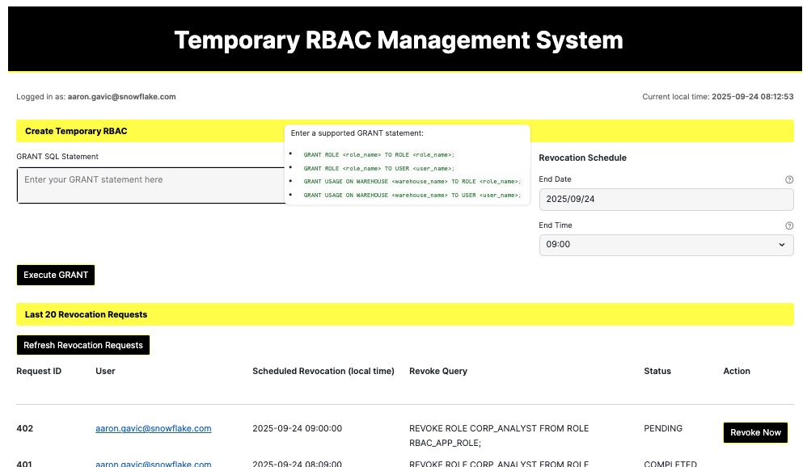

# Temporary RBAC Management Streamlit App

A Streamlit application for managing temporary RBAC grants in Snowflake.



## Features

### Core Functionality
- **Temporary RBAC Grants**: Execute GRANT statements with automatic scheduled revocation
  - Supports role-to-role, role-to-user, and warehouse usage grants
  - Built-in validation prevents granting admin roles (ACCOUNTADMIN, SYSADMIN, SECURITYADMIN, USERADMIN)
  - Minimum 5-minute future scheduling requirement for security
  - Automatic REVOKE query generation and scheduling

### Monitoring & Management
- **Pending Revocations Dashboard**: Real-time view of all scheduled revocation requests
  - Manual "Revoke Now" capability for immediate revocation
  - Status tracking (PENDING, COMPLETED, CANCELED)
  - Local timezone display for scheduled times
- **Execution History**: Complete audit trail of the last 20 RBAC operations
  - Tracks both GRANT and REVOKE operations
  - Shows execution timestamps, query IDs, and status
  - User attribution for all operations

### Automation & Scheduling
- **Automated Revocation Processing**: Background task runs at 5 minutes past each hour
  - Processes due revocations automatically via RBAC_REVOKE_TASK
  - Comprehensive error handling and logging
  - No manual intervention required for scheduled revocations

### Security & Compliance
- **Comprehensive Logging**: All operations logged to RBAC_LOG_EXECUTIONS table
- **Request Tracking**: Separate tracking table for revocation scheduling
- **User Context Awareness**: Automatic user detection and attribution
- **Input Validation**: Strict SQL pattern matching and security checks

## Prerequisites

1. Snowflake account with SECURITYADMIN access
2. RBAC solution deployed (run `rbac_solution.sql` first)
3. Snowflake CLI installed and configured
4. Target database and schema must exist (default: SANDBOX_DB.ADMIN)
5. Target warehouse must exist (default: BASIC_ADMIN_XS)

## Deployment

### Step 1: Deploy RBAC Solution
1. Review and modify variables in `rbac_solution.sql` if needed:
   - `app_db`: Target database (default: SANDBOX_DB)
   - `app_schema`: Target schema (default: ADMIN)
   - `app_wh`: Target warehouse (default: BASIC_ADMIN_XS)

2. Execute the RBAC solution script with SECURITYADMIN privileges:
   ```bash
   snow sql -f rbac_solution.sql --role SECURITYADMIN
   ```

### Step 2: Deploy Streamlit App
1. Navigate to the project directory:
   ```bash
   cd /path/to/temp-rbac
   ```

2. Review and modify `snowflake.yml` configuration if needed:
   - Update database, schema, and warehouse settings to match your environment
   - Ensure the stage path matches your target schema

3. Deploy the Streamlit app using Snowflake CLI:
   ```bash
   snow streamlit deploy --role rbac_app_role
   ```
   
   Use `--replace` flag for redeployment:
   ```bash
   snow streamlit deploy --role rbac_app_role --replace
   ```

4. The app will be deployed to your configured Snowflake account and accessible through the Snowflake web interface.

### Troubleshooting Deployment

If you encounter database context errors:
- Ensure the `rbac_app_role` has been created and granted to your user
- Verify the database and schema exist before deployment
- Check that your Snowflake CLI connection is properly configured
- Confirm the target warehouse exists and is accessible
- Ensure you have SECURITYADMIN privileges to run the initial setup script


## Usage

### Create Temporary RBAC
1. **Enter GRANT Statement**: Input a valid GRANT SQL statement in the text area
   - Must end with a semicolon
   - Must match supported patterns (see Supported GRANT Statements below)
2. **Schedule Revocation**: Select the date and time for automatic revocation
   - Must be at least 5 minutes in the future
   - Time is displayed in your local timezone
3. **Execute**: Click "Execute GRANT" to process the request
   - Grant is executed immediately
   - Revocation is automatically scheduled
   - Success/error messages are displayed

### Monitor Operations
- **Pending Revocations**: View all scheduled revocation requests
  - Shows request ID, user, scheduled time, and query
  - Use "Revoke Now" button for immediate manual revocation
  - Status tracking (PENDING, COMPLETED, CANCELED)
- **Execution History**: Complete audit trail of recent operations
  - Shows both GRANT and REVOKE operations
  - Includes timestamps, query IDs, and execution status
  - User attribution for all operations
- **Real-time Updates**: Use refresh buttons to update data or wait for automatic processing

## Supported GRANT Statements

- `GRANT ROLE <role_name> TO ROLE <role_name>;`
- `GRANT ROLE <role_name> TO USER <user_name>;`
- `GRANT USAGE ON WAREHOUSE <warehouse_name> TO ROLE <role_name>;`
- `GRANT USAGE ON WAREHOUSE <warehouse_name> TO USER <user_name>;`

## Security Notes

- **Admin Role Protection**: Admin roles (ACCOUNTADMIN, SYSADMIN, SECURITYADMIN, USERADMIN) cannot be granted
- **Future Scheduling**: All grants must be scheduled at least 5 minutes in the future
- **Comprehensive Auditing**: All operations are logged with user attribution and timestamps
- **Input Validation**: Strict regex patterns prevent SQL injection and unauthorized operations
- **Automated Cleanup**: Scheduled task automatically processes revocations without manual intervention
- **Role Isolation**: Application runs with dedicated `rbac_app_role` with minimal required privileges
